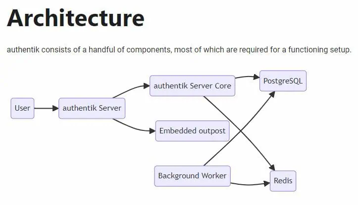

# AI Stack (WIP)

## Overview

This repository is a collection of services that are used to setup and deploy a "production ready" swarm cluster that powers my AI services.

### Portainer

As a devops noob, Portainer has been great for visualizing my swarm cluster and managing it.

### [Traefik](https://traefik.io/) (WIP)

Traefik is used as the reverse proxy for the cluster. It is configured to use Cloudflare DNS challenge. Additionally, it serves as a proxy for authentik and helps forward headers to other services. [This](https://github.com/ItalyPaleAle/traefik-forward-auth) looks promising.

### [Authentik](https://docs.goauthentik.io/docs) (WIP)

Authentik is used for authentication and authorization. It is configured to use the Cloudflare DNS API to automatically update the DNS records for the cluster.

<details>
<summary>Authentik Architecture</summary>



</details>


### [Grafana](https://grafana.com/docs/grafana/latest/datasources/prometheus/)

Grafana is used for monitoring and alerting. It is configured to use [Prometheus](https://prometheus.io/) as a data source. Additionally, it uses [cadvisor](https://github.com/google/cadvisor) to monitor resources and [node-exporter](https://github.com/prometheus/node_exporter) to monitor the nodes in the cluster.

### [Open-WebUI](https://github.com/open-webui/open-webui)

Open-WebUI is a web UI for controlling LLMs. It is configured to use the OpenAI API. I have outfitted it with custom models, agents, and prompts. I additionally use Open-WebUI to 

### [LiteLLM](https://docs.litellm.ai/docs/) <span style="font-size: 0.8em;">flashbang warning</span>

LiteLLM is a lightweight LLM proxy. Fantastic for testing and development, but I wouldn't use it in production. BricksLLM is faster, written in Go, but the solo devleoper now works for OpenAI.

### [Langfuse](https://langfuse.com/) (WIP)

Langfuse is a platform for monitoring and debugging LLMs. It is configured to use the OpenAI API.

### [Letta](https://docs.letta.com/) (WIP)

Agent development, memory, etc.

### [docker-mailserver](https://github.com/tomav/docker-mailserver) (WIP)

docker-mailserver is pretty much a command line mail server. I'm considering using mailcow or something similar, but this works for now.

### [MicroCeph](https://canonical-microceph.readthedocs-hosted.com/en/squid-stable/)

MicroCeph is a lightweight Ceph implementation. I think it was easier to setup than Ceph itself. It is configured similarly to docker swarm, which I thought was a nice touch.

<details>
<summary>MicroCeph Setup</summary>

#### Prerequisites
- 3 Ubuntu hosts (node-1, node-2, node-3)
- Private network for the cluster (10.0.0.0/16)
- at least 50GB of storage per VM
- SSH key access from node-1 → node-2 & node-3

#### `a` Install & Bootstrap

```bash
# 1. Install MicroCeph


# 2. Hold updates during setup
sudo snap refresh --hold microceph

# 3. Bootstrap the cluster on node-1 (10.0.0.2)
```

`1` Install MicroCeph

```bash
sudo snap install microceph
```

`2` Hold updates during setup

```bash
sudo snap refresh --hold microceph
```

`3` Bootstrap the cluster on node-1 (10.0.0.2)

```bash
sudo microceph cluster bootstrap \
  --public-network 10.0.0.0/16 \
  --cluster-network 10.0.0.0/16 \
  --mon-ip 10.0.0.2 \
  --microceph-ip 10.0.0.2
```

#### `b` Generate Join Tokens & Join node-2 & node-3

`1` Generate join tokens on node-1

```bash
sudo microceph cluster join-token
```

`2` Join node-2 & node-3

```bash
sudo microceph cluster add node-2
sudo microceph cluster add node-3
```

`3` Join node-2 & node-3 to the cluster

on node-2
```bash
sudo microceph cluster join <$node_2_token>
```

on node-3
```bash
sudo microceph cluster join <$node_3_token>
```

`4` Verify the cluster

```bash
sudo microceph cluster status
sudo ceph -s
```

#### `c` Add Disks as OSDs

`1` Add disks to node-1
```bash
sudo microceph disk add /dev/sdX --wipe
```

`2` Add disks to node-2
```bash
sudo microceph disk add /dev/sdY --wipe
```

`3` Add disks to node-3
```bash
sudo microceph disk add /dev/sdZ --wipe
```

`4` Verify the OSDs
```bash
sudo microceph osd status
sudo ceph osd tree
```

#### `d` Setup CephFS
`1` On any node, create a pool
```bash
sudo microceph.ceph osd pool create cephfs_meta 8
sudo microceph.ceph osd pool create cephfs_data 8
sudo microceph.ceph fs new <$named_fs> cephfs_meta cephfs_data
```

#### `e` Create a Shared Client Key

`1` on node-1
```bash
sudo ceph fs authorize <$named_fs> client.shared / rw \
  | sudo tee /etc/ceph/ceph.client.shared.keyring
sudo chmod 600 /etc/ceph/ceph.client.shared.keyring
```

#### `f` Distribute Config & Key to All Nodes

`1` Ensure /etc/ceph exists everywhere, then distribute:

```bash
for HOST in <$node_2_public_ip> <$node_3_public_ip>; do
  ssh root@$HOST "mkdir -p /etc/ceph"
  scp /var/snap/microceph/current/conf/ceph.conf \
      root@$HOST:/etc/ceph/ceph.conf
  scp /etc/ceph/ceph.client.shared.keyring \
      root@$HOST:/etc/ceph/ceph.client.shared.keyring
done
```

#### `g` Install FUSE Client & Mount on Each Node

```bash
for HOST in node-1 node-2 node-3; do
  ssh root@$HOST <<'EOF'
    apt update
    apt install -y ceph-fuse
    mkdir -p /mnt/shared
    umount /mnt/shared 2>/dev/null || true
    ceph-fuse -n client.shared /mnt/shared \
      --keyring=/etc/ceph/ceph.client.shared.keyring
EOF
done
```

#### `h` Automount with systemd

`1` Create `/etc/systemd/system/ceph-fuse-shared.service` on each node:

```bash
[Unit]
Description=Mount CephFS shared via ceph-fuse
After=network-online.target
Wants=network-online.target

[Service]
ExecStart=/usr/bin/ceph-fuse -n client.shared /mnt/shared \
  --keyring=/etc/ceph/ceph.client.shared.keyring
ExecStop=/bin/umount /mnt/shared
Restart=on-failure

[Install]
WantedBy=multi-user.target
```

</details>


### [minio](https://min.io/)

I love blob storage. Minio is a great solution if a service accepts S3.